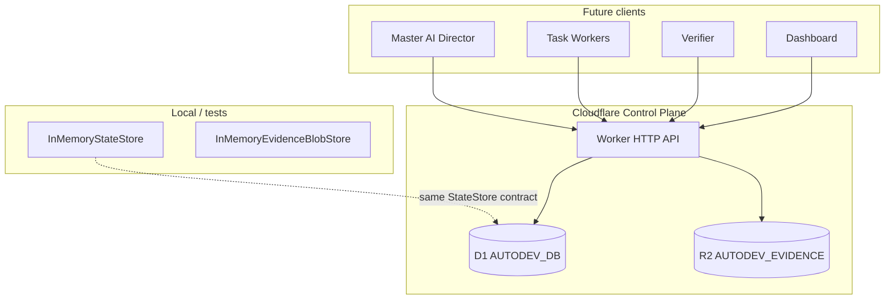

# assayer-autodev

Autonomous development and verification orchestration system for Assayer.

This repository contains a **TypeScript orchestration foundation** with typed domain models, an in-memory state store for local tests, and a **Cloudflare Worker control plane** (D1 + R2) for durable state and evidence storage. External integrations (AI providers, Cursor ACP, Playwright, GitHub, Assayer) are intentionally **not connected yet**.

## Architecture



### Module layout

```
src/
├── domain/           # Typed models, lifecycle enums, provenance
├── state/
│   ├── store.ts      # StateStore (sync, in-memory)
│   ├── async-store.ts
│   ├── in-memory-store.ts
│   ├── d1-store.ts   # D1StateStore (AsyncStateStore)
│   └── d1/           # D1 mappers + test SQLite adapter
├── evidence/
│   ├── blob-store.ts # EvidenceBlobStore interface
│   ├── in-memory-blob-store.ts
│   └── r2-blob-store.ts
├── api/
│   ├── router.ts     # JSON HTTP API
│   ├── validation.ts
│   └── middleware/auth.ts  # stub — add auth before deploy
└── worker/
    └── index.ts      # Cloudflare Worker entry
migrations/
└── 0001_initial.sql  # D1 schema
wrangler.toml         # placeholder bindings (no resources provisioned)
```

### D1 vs R2 roles

| Store | Role |
|-------|------|
| **D1 (`AUTODEV_DB`)** | Structured durable state: projects, tasks, workers, verification, permissions, budget, master inbox metadata |
| **R2 (`AUTODEV_EVIDENCE`)** | Large evidence blobs (screenshots, logs, artifacts). D1 `evidence` rows hold metadata + `content_ref` pointer |

Evidence metadata lives in D1; blob bytes live in R2 (or in-memory during tests).

### StateStore migration path

- `StateStore` — original sync interface used by `InMemoryStateStore`
- `AsyncStateStore` — async mirror for D1 and HTTP handlers
- `asAsyncStore()` — wraps sync store for API tests
- `D1StateStore` / `createD1StateStore()` — production persistence via D1

Domain types are shared; only the persistence adapter changes.

### HTTP API (control plane)

| Method | Route | Purpose |
|--------|-------|---------|
| GET | `/health` | Liveness |
| GET | `/api/projects/:projectId/state` | Project + master state |
| GET | `/api/projects/:projectId/tasks` | List tasks |
| GET | `/api/tasks/:taskId` | Get task |
| GET | `/api/tasks/:taskId/evidence` | Evidence metadata for task |
| GET | `/api/master/inbox?projectId=` | Master inbox (newest first) |
| POST | `/api/projects` | Create project |
| POST | `/api/requirements` | Create requirement |
| POST | `/api/tasks` | Create task |
| POST | `/api/worker-runs` | Create worker run |
| POST | `/api/worker-events` | Append worker event |
| POST | `/api/worker-reports` | Create worker report |
| POST | `/api/test-results` | Record test result |
| POST | `/api/evidence` | Create evidence (+ optional `blobBase64` → R2) |
| POST | `/api/verifier-runs` | Create or complete verifier run |
| POST | `/api/master/inbox` | Enqueue master inbox item |

**Authentication is not implemented.** `authMiddleware` is a pass-through stub; add auth before any deployment.

## Local development

**Requirements:** Node.js 20+

```bash
npm install

# Type-check domain + tests
npm run typecheck

# Type-check Worker (Cloudflare types)
npm run typecheck:worker

# Run all tests (in-memory + API + D1 via local SQLite — no Cloudflare account)
npm run test

# Validate Worker bundle (no deploy, no account required for dry-run bundling)
npm run worker:validate
```

Copy `.env.example` to `.env` when provisioning Cloudflare resources later.

### D1 migrations (when ready to provision)

After creating a real D1 database and updating `database_id` in `wrangler.toml`:

```bash
npx wrangler d1 migrations apply assayer-autodev-db --local   # local dev
npx wrangler d1 migrations apply assayer-autodev-db --remote  # production
```

## What remains intentionally unconnected

- OpenAI / Anthropic API clients
- Cursor ACP actuator
- Playwright browser automation
- GitHub / GitHub Actions
- Assayer product integration
- Cloudflare resource provisioning (placeholder IDs in `wrangler.toml`)
- API authentication
- Production deployment

## License

Private project — not for public distribution.
