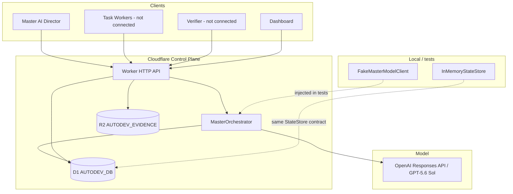

# assayer-autodev

Autonomous development and verification orchestration system for Assayer.

This repository contains a **TypeScript orchestration foundation** with typed domain models, an in-memory state store for local tests, a **Cloudflare Worker control plane** (D1 + R2), and a **Master AI director** that proposes the next orchestration step via the OpenAI Responses API. External implementation actuators (Cursor ACP, Playwright, GitHub, Assayer product) are intentionally **not connected yet**.

## Architecture



### Master AI role

The Master reads **authoritative D1 structured state** (project, requirements, definition of done, tasks, verifier results, tests, evidence, budget, blockers, inbox) plus a stored project objective. It returns a structured **proposal**: create tasks, wait, request verification, request human approval, replan, attempt final acceptance, finish, or block.

The Master **does not edit code**. Workers would implement tasks later. Model output is never treated as truth: the orchestrator validates JSON, then applies **code-level safety rules**, including a deterministic **FINISHED gate**.

D1 state is authoritative. Prior chat text and worker narrative are not.

**Blocker authority:** stored `blockers` rows are authoritative. Model `blockerSummaries` are advisory output only. The model cannot create, resolve, or clear authoritative blockers through narrative text.

### Hard budget enforcement

Master calls require a stored `llm_tokens` **hard** limit on the same project. Authorization uses that durable ledger (not request-body pricing). If the ledger is missing, has no `llm_tokens` hard limit, is exhausted, or remaining capacity is below the estimated call size, the orchestrator returns `BLOCKED` and **does not call the model**.

Actual token usage is recorded as budget entries when the model reports usage. This schema does not store a separate reservation row; `reservedAmount` is `0` and remaining capacity is `hardLimit - consumed`.

### Operational initialization sequence

1. Create a project (`POST /api/projects`)
2. Create a hard-limit `llm_tokens` budget (`POST /api/projects/:projectId/budgets`)
3. Optionally create requirements and a release contract
4. Invoke Master (`POST /api/master/run` with `projectId` and optional `trigger`/`context` only)
5. Inspect the Master run, created tasks, and budget consumption

Model output is a **recommendation**. Tasks, budget entries, release contracts, acceptance criteria, and blockers in D1 are **authoritative**. The FINISHED gate and hard budget check are **code-enforced**.

### Deterministic FINISHED gate

`FINISHED` is a guarded state, not a model opinion. The model cannot bypass these checks:

1. A stored release contract exists
2. Every applicable acceptance criterion is `PASS`
3. Open blockers = 0
4. Final independent verification `PASS` (completed verifier run on an `acceptance` task)
5. Final regression `PASS` (latest result for every active `regression` test case is `PASS`, and at least one such case exists)
6. Required evidence kinds and labels from the release contract are present

If the model proposes `FINISHED` and any check fails, the orchestrator persists the run with `enforcedAction = BLOCKED`, records `finishedBlockedReasons`, and does not mark the project completed.

### Responses API integration

Live Master calls use the OpenAI **Responses API** with model **`gpt-5.6-sol`** and **strict structured JSON output**. Token/cost metadata is captured when the API returns usage. Pricing/estimate values are injectable; they are not hard-coded throughout business logic.

Unit tests never call OpenAI. They inject `FakeMasterModelClient`.

### Module layout

```
src/
├── domain/           # Typed models, lifecycle enums, provenance, Master AI types
├── master/
│   ├── prompt.ts     # Versioned system prompt (separate from orchestration)
│   ├── schema.ts     # Strict JSON schema for Responses API
│   ├── client.ts     # MasterModelClient + FakeMasterModelClient
│   ├── openai-client.ts
│   ├── orchestrator.ts
│   └── release-gate.ts
├── state/            # In-memory + D1 stores
├── evidence/
├── api/              # JSON HTTP API + auth
└── worker/
    └── index.ts      # Cloudflare Worker entry
migrations/
├── 0001_initial.sql
└── 0002_master_ai.sql
wrangler.toml         # Worker config (real D1/R2 bindings; no secrets in repo)
```

## Cloudflare resources

Dedicated **assayer-autodev** infrastructure has been provisioned in Cloudflare (separate from Assayer production/preview):

| Binding | Resource | Role |
|---------|----------|------|
| `AUTODEV_DB` | D1 `assayer-autodev` | Structured durable state |
| `AUTODEV_EVIDENCE` | R2 `assayer-autodev-evidence` | Evidence blob storage |

`wrangler.toml` references these real bindings. **No secret values, API tokens, or credentials are stored in this repository.**

**Not yet done:** remote D1 migration for `0002_master_ai.sql`, Worker deployment, and setting `OPENAI_API_KEY` in Cloudflare.

Protected routes fail closed (`503 auth_misconfigured`) if `AUTODEV_SERVICE_TOKEN` is missing at runtime. Live Master runs fail closed if `OPENAI_API_KEY` is missing (`503 master_misconfigured` / real client constructor error).

`AUTODEV_SERVICE_TOKEN` is required for the final secured deployment. `OPENAI_API_KEY` is required for the first live Master model call.

### D1 vs R2 roles

| Store | Role |
|-------|------|
| **D1 (`AUTODEV_DB`)** | Structured durable state: projects, tasks, workers, verification, permissions, budget, master inbox, master runs, release contracts |
| **R2 (`AUTODEV_EVIDENCE`)** | Large evidence blobs (screenshots, logs, artifacts). D1 `evidence` rows hold metadata + `content_ref` pointer |

Evidence metadata lives in D1; blob bytes live in R2 (or in-memory during tests).

### StateStore migration path

- `StateStore` — original sync interface used by `InMemoryStateStore`
- `AsyncStateStore` — async mirror for D1 and HTTP handlers
- `asAsyncStore()` — wraps sync store for API tests
- `D1StateStore` / `createD1StateStore()` — production persistence via D1

Domain types are shared; only the persistence adapter changes.

### HTTP API (control plane)

| Method | Route | Purpose |
|--------|-------|---------|
| GET | `/health` | Liveness |
| GET | `/api/projects/:projectId/state` | Project + master state |
| GET | `/api/projects/:projectId/tasks` | List tasks |
| GET | `/api/tasks/:taskId` | Get task |
| GET | `/api/tasks/:taskId/evidence` | Evidence metadata for task |
| GET | `/api/master/inbox?projectId=` | Master inbox (newest first) |
| POST | `/api/master/run` | Run Master against stored project state (`projectId`, optional `trigger`/`context` only) |
| GET | `/api/master/runs?projectId=` | List Master runs |
| GET | `/api/master/runs/:runId` | Get Master run |
| POST | `/api/projects/:projectId/release-contract` | Store release contract + acceptance criteria |
| GET | `/api/projects/:projectId/release-contract` | Get latest release contract |
| POST | `/api/projects/:projectId/budgets` | Create a resource budget (`resourceType`, `hardLimit`, optional `softLimit`, `unit`) |
| GET | `/api/projects/:projectId/budgets` | List resource budgets for the project |
| GET | `/api/projects/:projectId/budgets/:budgetId` | Get one resource budget (`budgetId` = `resourceType`, e.g. `llm_tokens`) |
| POST | `/api/projects` | Create project |
| POST | `/api/requirements` | Create requirement |
| POST | `/api/tasks` | Create task |
| POST | `/api/worker-runs` | Create worker run |
| POST | `/api/worker-events` | Append worker event |
| POST | `/api/worker-reports` | Create worker report |
| POST | `/api/test-results` | Record test result |
| POST | `/api/evidence` | Create evidence (+ optional `blobBase64` → R2) |
| POST | `/api/verifier-runs` | Create or complete verifier run |
| POST | `/api/master/inbox` | Enqueue master inbox item |

`POST /api/master/run` does **not** accept model instructions, system prompts, or requirement overrides. The stored project and release contract are the only source of objectives and acceptance rules.

## Control-plane security model

This API is **private machine-to-machine infrastructure**. It is not a browser-facing service.

| Control | Behavior |
|---------|----------|
| Authentication | Protected routes require `Authorization: Bearer <token>` |
| Secret binding | `AUTODEV_SERVICE_TOKEN` and `OPENAI_API_KEY` via `wrangler secret put` — **never** in source, tests, README examples, or `.env.example` |
| Fail closed | Protected routes return `503 auth_misconfigured` if the service token is missing at runtime |
| Master fail closed | Live OpenAI client refuses to construct without `OPENAI_API_KEY`; POST `/api/master/run` returns `503` if the orchestrator is not configured |
| Roles (V1) | Route policies declare `master`, `worker`, `verifier`, `admin`; the service token maps temporarily to `admin` |
| Request limits | JSON metadata max **256 KiB**; invalid `Content-Length` rejected |
| Evidence bootstrap | `blobBase64` is **temporary** — max decoded **64 KiB** for small test blobs only |
| Future evidence | Production uploads should go **directly to controlled R2 paths**, not giant JSON bodies |
| Content-Type | POST JSON routes require `application/json` (`415` otherwise) |
| CORS | **No wildcard CORS** — not enabled |
| Errors | No stack traces, secrets, SQL, or env vars in client responses |
| Headers | `X-Content-Type-Options: nosniff`, `Cache-Control: no-store` |
| `/health` | Unauthenticated minimal `{ "status": "ok" }` only |
| Model logging | Prompts and API keys are not logged |

**Do not deploy to Cloudflare without setting `AUTODEV_SERVICE_TOKEN`.** This is required for the first private deployment.

**Do not make a live Master call without setting `OPENAI_API_KEY`.** Apply remote migration `0002_master_ai.sql` first.

### Setting secrets (when deploying)

```bash
npx wrangler secret put AUTODEV_SERVICE_TOKEN
npx wrangler secret put OPENAI_API_KEY
```

Do not paste secret values into any file tracked by git.

## Local development

**Requirements:** Node.js 20+

```bash
npm install

# Type-check domain + tests
npm run typecheck

# Type-check Worker (Cloudflare types)
npm run typecheck:worker

# Run all tests (in-memory + API + D1 via local SQLite — no Cloudflare account, no live OpenAI)
npm run test

# Validate Worker bundle (no deploy, no account required for dry-run bundling)
npm run worker:validate
```

Copy `.env.example` to `.env` for local tooling when needed. Do not commit real credentials.

### D1 migrations

Schema files:

- `migrations/0001_initial.sql` — base control-plane tables, including `budget_ledger` and `budget_entries`
- `migrations/0002_master_ai.sql` — `master_runs`, `release_contracts`, `acceptance_criteria`, `blockers`

The budget HTTP API uses the existing 0001 tables. **No 0003 migration is required** for Master budgets.

Local apply (no remote mutation):

```bash
npx wrangler d1 migrations apply assayer-autodev --local
```

When ready to apply migrations to the remote `assayer-autodev` database:

```bash
npx wrangler d1 migrations apply assayer-autodev --remote
```

Worker deployment is a separate step after remote migration and secret configuration.

## What remains intentionally unimplemented

- Cursor ACP actuator / workers that edit code
- Playwright browser execution
- Independent verifier execution (records can be stored; no executor yet)
- GitHub Actions executor
- Anthropic model client
- Assayer product integration
- Per-role token issuance (V1 uses one service token mapped to admin)
- Direct-to-R2 presigned/large evidence uploads
- Remote application of migration `0002_master_ai.sql` and Worker deployment
- Live OpenAI secret installation

## License

Private project — not for public distribution.
