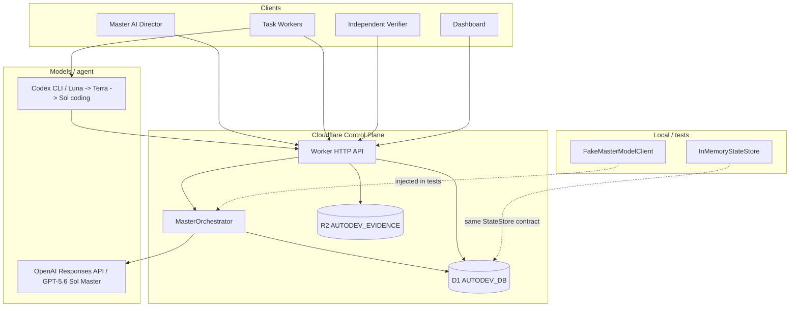

# assayer-autodev

Autonomous development and verification orchestration system for Assayer.

This repository contains the Assayer AutoDev orchestration system: a **Cloudflare Worker control plane** (D1 + R2), a **Master AI director**, leased GitHub Actions implementation workers, independent Playwright browser verification, bounded repair orchestration, an observe-only auditor/watchdog, and controlled post-verification candidate promotion.

The hardened source is intended to fail closed when candidate provenance, exact-candidate verification, repair lineage, or promotion safety cannot be established. Real Assayer targets remain disabled until disposable end-to-end validation is complete.

## Architecture



### Master AI role

The Master reads **authoritative D1 structured state** (project, requirements, definition of done, tasks, verifier results, tests, evidence, budget, blockers, inbox) plus a stored project objective. It returns a structured **proposal**: create tasks, wait, request verification, request human approval, replan, attempt final acceptance, finish, or block.

The Master **does not edit code**. Leased implementation workers produce isolated code candidates; independent verification and controlled promotion remain separate responsibilities. Model output is never treated as truth: the orchestrator validates JSON, then applies **code-level safety rules**, including a deterministic **FINISHED gate**.

D1 state is authoritative. Prior chat text and worker narrative are not.

**Blocker authority:** stored `blockers` rows are authoritative. Model `blockerSummaries` are advisory output only. The model cannot create, resolve, or clear authoritative blockers through narrative text.

### Hard budget enforcement

Master calls require a stored `llm_tokens` **hard** limit on the same project. Authorization uses that durable ledger (not request-body pricing). If the ledger is missing, has no `llm_tokens` hard limit, is exhausted, or remaining capacity is below the estimated call size, the orchestrator returns `BLOCKED` and **does not call the model**.

Implementation coding uses a separate durable `llm_cost_usd` project budget. Before dispatch, AutoDev reserves conservative headroom for the selected Codex model and subtracts active worker reservations so parallel workers do not all consume the same apparent remaining budget. When insufficient headroom remains, orchestration reports `waiting_for_budget` without discarding tasks, candidates, verification state, or prior spend. The hard limit can be increased in place through the budget-increase API.

Codex usage is recorded as dollar-denominated budget entries, including cached reads, billed prompt-cache writes, and GPT-5.6 long-context multipliers. If a Codex process ends before emitting its terminal usage event, AutoDev conservatively records the model's reservation amount rather than silently undercounting. A timeout/non-zero Codex exit that nevertheless leaves changed code passing the trusted deterministic test still preserves that candidate for independent verification.

### Operational initialization sequence

1. Create a project (`POST /api/projects`)
2. Create a hard-limit `llm_tokens` budget (`POST /api/projects/:projectId/budgets`)
3. Optionally create requirements and a release contract
4. Invoke Master (`POST /api/master/run` with `projectId` and optional `trigger`/`context` only)
5. Inspect the Master run, created tasks, and budget consumption

Model output is a **recommendation**. Tasks, budget entries, release contracts, acceptance criteria, and blockers in D1 are **authoritative**. The FINISHED gate and hard budget check are **code-enforced**.

### Deterministic FINISHED gate

`FINISHED` is a guarded state, not a model opinion. The model cannot bypass these checks:

1. A stored release contract exists
2. Every applicable acceptance criterion is `PASS`
3. Open blockers = 0
4. Final independent verification `PASS` (completed verifier run on an `acceptance` task)
5. Final regression `PASS` (latest result for every active `regression` test case is `PASS`, and at least one such case exists)
6. Required evidence kinds and labels from the release contract are present

If the model proposes `FINISHED` and any check fails, the orchestrator persists the run with `enforcedAction = BLOCKED`, records `finishedBlockedReasons`, and does not mark the project completed.

### Responses API integration

Live Master calls use the OpenAI **Responses API** with model **`gpt-5.6-sol`** and **strict structured JSON output**. Token/cost metadata is captured when the API returns usage. Pricing/estimate values are injectable; they are not hard-coded throughout business logic.

Unit tests never call OpenAI. They inject `FakeMasterModelClient`.

### Module layout

```
src/
├── domain/           # Typed models, lifecycle enums, provenance, Master AI types
├── master/
│   ├── prompt.ts     # Versioned system prompt (separate from orchestration)
│   ├── schema.ts     # Strict JSON schema for Responses API
│   ├── client.ts     # MasterModelClient + FakeMasterModelClient
│   ├── openai-client.ts
│   ├── orchestrator.ts
│   └── release-gate.ts
├── state/            # In-memory + D1 stores
├── evidence/
├── api/              # JSON HTTP API + auth
└── worker/
    └── index.ts      # Cloudflare Worker entry
migrations/
├── 0001_initial.sql
├── ...
└── 0008_candidate_lineage_verification.sql
wrangler.toml         # Worker config (real D1/R2 bindings; no secrets in repo)
```

## Cloudflare resources

Dedicated **assayer-autodev** infrastructure has been provisioned in Cloudflare (separate from Assayer production/preview):

| Binding | Resource | Role |
|---------|----------|------|
| `AUTODEV_DB` | D1 `assayer-autodev` | Structured durable state |
| `AUTODEV_EVIDENCE` | R2 `assayer-autodev-evidence` | Evidence blob storage |

`wrangler.toml` references these real bindings. **No secret values, API tokens, or credentials are stored in this repository.**

Deployment state is environment-specific. Before a hardened deployment, run `npm run validate:local`, confirm the dedicated AutoDev D1 database is migrated through the required version, and verify runtime secrets/configuration without placing secret values in source. See `PRE_DEPLOY_CHECKLIST.md`.

Protected routes fail closed (`503 auth_misconfigured`) if `AUTODEV_SERVICE_TOKEN` is missing at runtime. Live Master runs fail closed if `OPENAI_API_KEY` is missing (`503 master_misconfigured` / real client constructor error).

`AUTODEV_SERVICE_TOKEN` is required for the secured deployment. The Cloudflare Worker `OPENAI_API_KEY` is used by the Master. The GitHub Actions repository secret with the same name is independently configured for the Codex implementation worker. Private target repositories may additionally use the least-privilege `AUTODEV_TARGET_REPO_READ_TOKEN`, which is exposed only to trusted git clone/fetch subprocesses.

### D1 vs R2 roles

| Store | Role |
|-------|------|
| **D1 (`AUTODEV_DB`)** | Structured durable state: projects, tasks, workers, verification, permissions, budget, master inbox, master runs, release contracts |
| **R2 (`AUTODEV_EVIDENCE`)** | Large evidence blobs (screenshots, logs, artifacts). D1 `evidence` rows hold metadata + `content_ref` pointer |

Evidence metadata lives in D1; blob bytes live in R2 (or in-memory during tests).

### StateStore migration path

- `StateStore` — original sync interface used by `InMemoryStateStore`
- `AsyncStateStore` — async mirror for D1 and HTTP handlers
- `asAsyncStore()` — wraps sync store for API tests
- `D1StateStore` / `createD1StateStore()` — production persistence via D1

Domain types are shared; only the persistence adapter changes.

### HTTP API (control plane)

| Method | Route | Purpose |
|--------|-------|---------|
| GET | `/health` | Liveness |
| GET | `/api/projects/:projectId/state` | Project + master state |
| GET | `/api/projects/:projectId/tasks` | List tasks |
| GET | `/api/tasks/:taskId` | Get task |
| GET | `/api/tasks/:taskId/evidence` | Evidence metadata for task |
| GET | `/api/master/inbox?projectId=` | Master inbox (newest first) |
| POST | `/api/master/run` | Run Master against stored project state (`projectId`, optional `trigger`/`context` only) |
| GET | `/api/master/runs?projectId=` | List Master runs |
| GET | `/api/master/runs/:runId` | Get Master run |
| POST | `/api/projects/:projectId/release-contract` | Store release contract + acceptance criteria |
| GET | `/api/projects/:projectId/release-contract` | Get latest release contract |
| POST | `/api/projects/:projectId/budgets` | Create a resource budget (`resourceType`, `hardLimit`, optional `softLimit`, `unit`) |
| GET | `/api/projects/:projectId/budgets` | List resource budgets for the project |
| GET | `/api/projects/:projectId/budgets/:budgetId` | Get one resource budget (`budgetId` = `resourceType`, e.g. `llm_tokens` or `llm_cost_usd`) |
| POST | `/api/projects/:projectId/budgets/:budgetId/increase` | Add budget headroom without resetting consumed spend or project state |
| POST | `/api/projects/:projectId/budget-entries` | Record idempotent resource usage (used by coding workers for actual/estimated Codex spend) |
| POST | `/api/projects` | Create project |
| POST | `/api/requirements` | Create requirement |
| POST | `/api/tasks` | Create task |
| POST | `/api/worker-runs` | Create worker run |
| POST | `/api/worker-events` | Append worker event |
| POST | `/api/worker-reports` | Create worker report |
| POST | `/api/test-results` | Record test result |
| POST | `/api/evidence` | Create evidence (+ optional `blobBase64` → R2) |
| POST | `/api/verifier-runs` | Create or complete verifier run |
| POST | `/api/master/inbox` | Enqueue master inbox item |

`POST /api/master/run` does **not** accept model instructions, system prompts, or requirement overrides. The stored project and release contract are the only source of objectives and acceptance rules.

## Control-plane security model

This API is **private machine-to-machine infrastructure**. It is not a browser-facing service.

| Control | Behavior |
|---------|----------|
| Authentication | Protected routes require `Authorization: Bearer <token>` |
| Secret binding | `AUTODEV_SERVICE_TOKEN` and `OPENAI_API_KEY` via `wrangler secret put` — **never** in source, tests, README examples, or `.env.example` |
| Fail closed | Protected routes return `503 auth_misconfigured` if the service token is missing at runtime |
| Master fail closed | Live OpenAI client refuses to construct without the Worker `OPENAI_API_KEY`; POST `/api/master/run` returns `503` if the orchestrator is not configured |
| Coding secret isolation | GitHub Actions passes its `OPENAI_API_KEY` only to the trusted actuator; Codex receives it as `CODEX_API_KEY`, while repository-controlled setup/tests receive a sanitized environment |
| Private target clone | Optional `AUTODEV_TARGET_REPO_READ_TOKEN` is used only as ephemeral Git HTTP auth and is not written into the clone URL or repository config |
| Roles (V1) | Route policies declare `master`, `worker`, `verifier`, `admin`; the service token maps temporarily to `admin` |
| Request limits | JSON metadata max **256 KiB**; invalid `Content-Length` rejected |
| Evidence bootstrap | `blobBase64` is **temporary** — max decoded **64 KiB** for small test blobs only |
| Future evidence | Production uploads should go **directly to controlled R2 paths**, not giant JSON bodies |
| Content-Type | POST JSON routes require `application/json` (`415` otherwise) |
| CORS | **No wildcard CORS** — not enabled |
| Errors | No stack traces, secrets, SQL, or env vars in client responses |
| Headers | `X-Content-Type-Options: nosniff`, `Cache-Control: no-store` |
| `/health` | Unauthenticated minimal `{ "status": "ok" }` only |
| Model logging | Prompts and API keys are not logged |

**Do not deploy to Cloudflare without setting `AUTODEV_SERVICE_TOKEN`.** This is required for the first private deployment.

**Do not make a live Master call without setting `OPENAI_API_KEY`.** Before hardened runtime use, bring the dedicated AutoDev D1 database to the migration level required by this checkout (currently through `0008_candidate_lineage_verification.sql`).

### Setting secrets (when deploying)

```bash
npx wrangler secret put AUTODEV_SERVICE_TOKEN
npx wrangler secret put OPENAI_API_KEY
```

Do not paste secret values into any file tracked by git.

## Local development

**Requirements:** Node.js 20+

Run the complete fail-closed local validation gate with:

```bash
npm ci
npm run validate:local
```

The repository also includes `.github/workflows/validate.yml`, which runs the same gate on pushes to `main`, pull requests, and manual dispatch. It requires no application secrets.

```bash
npm install

# Type-check domain + tests
npm run typecheck

# Type-check Worker (Cloudflare types)
npm run typecheck:worker

# Run all tests (in-memory + API + D1 via local SQLite — no Cloudflare account, no live OpenAI)
npm run test

# Validate Worker bundle (no deploy, no account required for dry-run bundling)
npm run worker:validate
```

Copy `.env.example` to `.env` for local tooling when needed. Do not commit real credentials.

### D1 migrations

Schema files:

- `migrations/0001_initial.sql` — base control-plane tables, including `budget_ledger` and `budget_entries`
- `migrations/0002_master_ai.sql` — `master_runs`, `release_contracts`, `acceptance_criteria`, `blockers`

The budget HTTP API uses the existing 0001 tables. **No 0003 migration is required** for Master budgets.

Local apply (no remote mutation):

```bash
npx wrangler d1 migrations apply assayer-autodev --local
```

When ready to apply migrations to the remote `assayer-autodev` database:

```bash
npx wrangler d1 migrations apply assayer-autodev --remote
```

Worker deployment is a separate step after remote migration and secret configuration.

## Current controlled limitations

- The implementation actuator is **Codex CLI**, using GPT-5.6 Luna for original work and repair 1, Terra on repair 2, and Sol on repair 3; the default three-repair limit then stops the chain. Cursor is no longer required by the implementation workflow.
- Coding spend is fail-closed before dispatch when `llm_cost_usd` headroom is insufficient. The reservation is conservative admission control, not a provider-side per-request dollar ceiling; actual usage is reconciled after each Codex run. Active-run subtraction protects the normal single orchestration cycle, but truly concurrent dispatcher invocations are not yet one atomic D1 reservation transaction.
- Codex is pinned to 0.148.0 for the initial proof and bounded to workspace-write/no-network execution, approval mode `never`, standard service tier, disabled fast/multi-agent/code-mode-host features, and a five-minute coding timeout.
- Passing changed code is persisted as a candidate even after an abnormal Codex exit. A provider interruption before trusted tests pass may still discard that failing partial workspace; no unverified partial patch is promoted merely to preserve progress.
- Exact-candidate browser verification and controlled promotion remain separate from the coding worker. The builder cannot approve or promote its own work.
- Candidate patch bootstrap through JSON/base64 remains intentionally limited to small artifacts; large real changes will eventually need direct/chunked R2 transfer.
- V1 still maps the single service token to the administrative machine role rather than issuing separate per-role tokens.
- Real Assayer targets remain disabled until disposable PASS and REPAIR end-to-end proofs pass on the exact deployed commit.

## License

Private project — not for public distribution.
