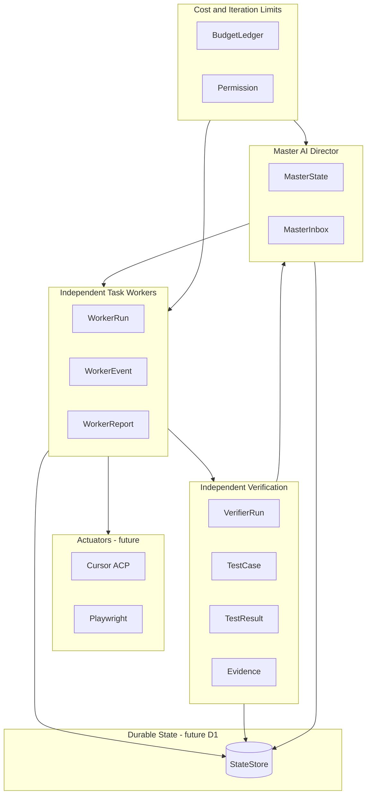

# assayer-autodev

Autonomous development and verification orchestration system for Assayer.

This repository contains the **local TypeScript foundation** for a modular orchestration system. It defines typed domain models and an in-memory state store. External integrations (AI providers, Cursor ACP, Playwright, Cloudflare D1, GitHub, etc.) are intentionally **not** implemented yet.

## Architecture

The system is designed to support these roles as separate, composable layers:



### Module layout

```
src/
├── domain/          # Typed models and lifecycle enums
│   ├── common.ts    # Provenance, timestamps, shared outcomes
│   ├── project.ts
│   ├── requirement.ts   # Requirement, DefinitionOfDone, FinalAcceptanceRun
│   ├── task.ts          # Task, TaskDependency, TaskStatus
│   ├── worker.ts        # WorkerRun, WorkerEvent, WorkerReport
│   ├── test.ts          # TestCase, TestResult
│   ├── evidence.ts
│   ├── permission.ts
│   ├── git.ts           # GitRevision, Deployment
│   ├── verifier.ts
│   ├── master.ts        # MasterState, MasterInboxItem
│   └── budget.ts        # BudgetLedger, soft/hard limits
└── state/
    ├── store.ts         # StateStore interface
    └── in-memory-store.ts
```

### Domain highlights

| Concept | Key types |
|---------|-----------|
| Task lifecycle | `pending` → `ready` → `assigned` → `in_progress` → `awaiting_verification` → `completed` / `failed` / `cancelled` |
| Verification | `PASS`, `FAIL`, `INCONCLUSIVE` |
| Permissions | `allow`, `deny`, `escalate` |
| Budget limits | `soft` (warn/block at director discretion) vs `hard` (must stop) |
| Provenance | Every task/result/evidence record carries `projectId` and optional `taskId`, `workerRunId`, `verifierRunId`, `gitRevisionId`, `deploymentId` |

### State store

`StateStore` is the persistence contract. `InMemoryStateStore` provides a minimal, auditable implementation for local development and tests. A Cloudflare D1 adapter can implement the same interface later without changing domain types.

## Local development

**Requirements:** Node.js 20+

```bash
# Install dependencies
npm install

# Type-check
npm run typecheck

# Run tests
npm run test

# Watch tests during development
npm run test:watch
```

Copy `.env.example` to `.env` when you add integrations later. The foundation does not read environment variables yet.

## What is intentionally out of scope (for now)

- OpenAI / Anthropic API clients
- Cursor ACP actuator wiring
- Playwright browser automation
- GitHub or Cloudflare API calls
- Cloudflare D1 persistence
- Deployment to any environment

## License

Private project — not for public distribution.
